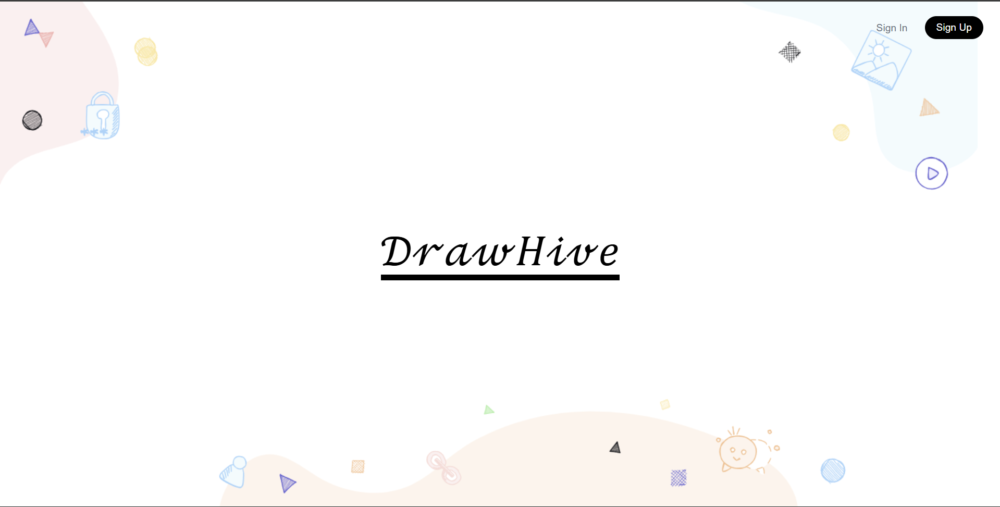
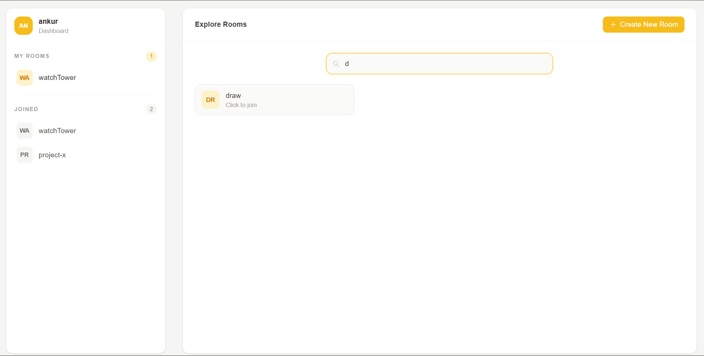
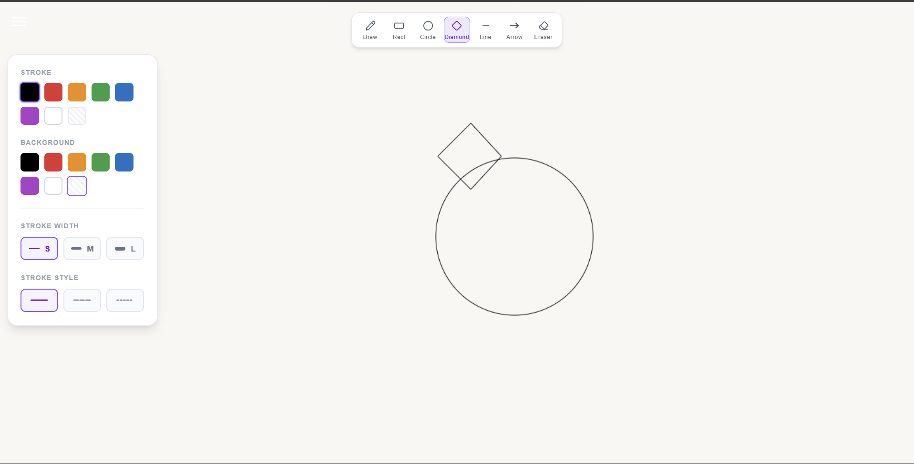

# 🐝 **DrawHive** – Real-Time Collaborative Drawing Platform

[](https://nextjs.org)
[](https://react.dev)
[](https://typescriptlang.org)
[](https://prisma.io)
[](https://docker.com)
[](https://turborepo.com)

**DrawHive** is a modern, real-time collaborative whiteboard application where users can create rooms, invite friends, and draw together using advanced tools like pencil, shapes (circle, rectangle, diamond, line, arrow), eraser, with customizable colors, line widths, and dashes. Includes user authentication, dashboard for managing rooms, in-room chat, and seamless real-time sync.

## ✨ **Key Features**
- **Real-Time Collaboration**: WebSocket-powered drawing sync with Redis pub/sub for low-latency broadcasts.
- **Rich Drawing Tools**: Pencil, Circle, Rectangle, Diamond, Line, Arrow, Eraser + style customization (color, fill, width, dash).
- **Room Management**: Create owned rooms with unique slugs, join public rooms, list joined/owned rooms in dashboard.
- **Authentication**: Secure sign-up/sign-in with JWT, bcrypt-hashed passwords.
- **Chat**: Real-time room chat with message persistence and delete support.
- **Responsive UI**: Next.js App Router, TailwindCSS, Framer Motion animations.
- **Production-Ready**: Docker Compose (Postgres + Redis), GitHub Actions CI/CD.

## 🏗️ **Architecture**
```
Frontend (Next.js:3000) ←→ HTTP Backend (Express:3005) ←→ DB (Postgres)
                        ↑
                   WS Backend (ws:8080 + Redis:6379) → Pub/Sub Broadcasts
```
- **Frontend**: `apps/frontend` – Canvas drawing game, dashboard, auth pages.
- **HTTP Backend**: `apps/http-backend` – Auth, user/room APIs.
- **WS Backend**: `apps/ws-backend` – RoomManager (singleton), User/WS handling, broadcasts.
- **DB**: `packages/db` – Prisma schema (User, Room, RoomMember, Chat).
- **Shared**: Turborepo monorepo, pnpm workspaces, shared ESLint/TS configs.

## 🚀 **Quick Start (Docker)**
1. Copy `.env.example` to `.env` and set `POSTGRES_PASSWORD`, `JWT_SECRET`.
2. Run:
   ```bash
   docker-compose up -d
   ```
3. Open [http://localhost:3000](http://localhost:3000) 🎉

**Services**:
- Frontend: http://localhost:3000
- HTTP API: http://localhost:3005/v1/user
- WS: ws://localhost:8080/?token=...
- DB: localhost:5432, Redis: localhost:6379

## 🛠️ **Local Development**
```bash
# Install deps
pnpm install

# Dev (all services)
pnpm turbo run dev

# Or individual:
pnpm --filter frontend dev
pnpm --filter http-backend dev
pnpm --filter ws-backend dev

# DB migrations
pnpm --filter db db:generate db:push
```

## 📁 **Project Structure**
```
.
├── apps/
│   ├── frontend/          # Next.js app
│   ├── http-backend/      # Express REST API
│   └── ws-backend/        # WebSocket server
├── packages/
│   ├── db/               # Prisma client
│   ├── eslint-config/    # Shared linting
│   └── typescript-config # Shared TS configs
├── docker/               # Dockerfiles
├── docker-compose.yml
├── turbo.json
└── pnpm-workspace.yaml
```

## 🌐 **API Endpoints** (HTTP Backend)
- `POST /v1/user/sign-up`, `POST /v1/user/sign-in`
- `GET /dashboard` (joined rooms), `GET /roomOwned`
- Protected with JWT.

## 📱 **Screenshots**

### 1. Landing Page


### 2. Dashboard (Owned & Joined Rooms)


### 3. Real-Time Canvas Drawing


**To add real screenshots:**
1. Run `docker-compose up` and open http://localhost:3000
2. Take screenshots (Landing, Dashboard, Canvas in action)
3. Save images to `/public/screenshots/` (e.g., `landing.png`)
4. Update Markdown: ``
5. Commit & push (GitHub renders `/public/` images automatically)

## 🔮 **Roadmap & Progress**
- ✅ Initialized Turborepo, backends, DB schema
- ✅ Auth system, WS rooms, canvas tools (rect/circle/pencil)
- ✅ Dashboard, chat persistence
- ⏳  more shapes/tools, file export, video/audio calls

## 🤝 **Contributing**
1. Fork & clone.
2. `pnpm install`.
3. Create feature branch.
4. Submit PR!

## 📄 **License**
MIT

**Built BY Ankur**

